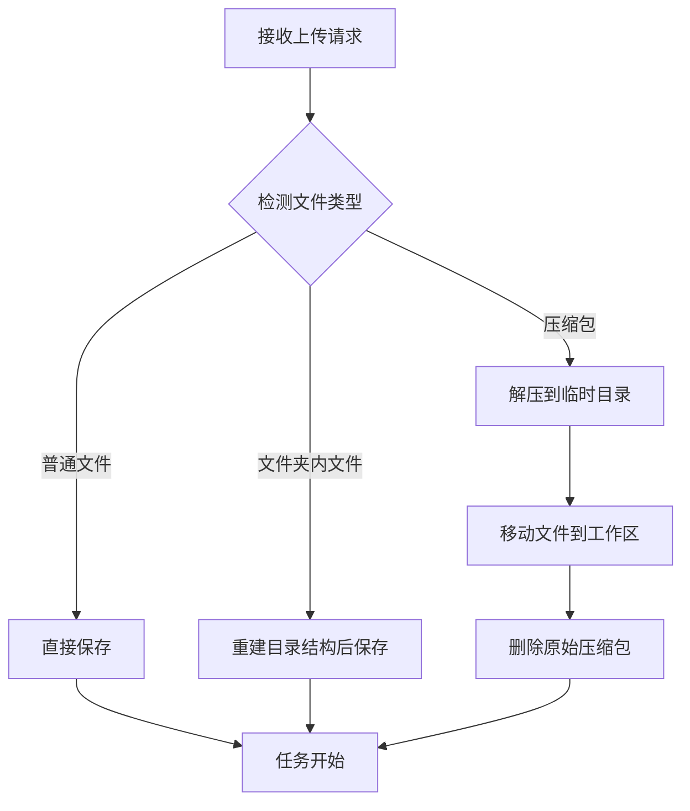

# 文件上传指南

> **文档版本**: v2.0  
> **最后更新**: 2025-01-17  
> **预计阅读时间**: 10 分钟

本指南详细介绍 MathModelAgent 强大的文件上传功能，帮助您高效地为建模任务提供数据。

## 📋 功能概述

系统支持三种灵活的上传方式，以满足不同场景的需求：

1.  **单个/多个文件上传**: 快速上传零散文件。
2.  **文件夹上传**: 完整保留数据目录结构。
3.  **压缩包上传**: 自动解压，简化大批量数据上传。

## 📁 支持的文件格式

### 数据文件

-   **文本**: `.txt`, `.md`, `.json`
-   **表格**: `.csv`, `.xlsx`, `.xls`
-   **代码**: `.py`, `.r`, `.ipynb`
-   **图片**: `.png`, `.jpg`, `.jpeg`, `.gif`, `.pdf`
-   **文档**: `.docx`, `.pptx`

### 压缩包（自动解压）

-   `.zip`
-   `.rar`
-   `.7z`
-   `.tar`
-   `.gz`

## 🚀 使用方法

### 方法一：上传单个或多个文件

这是最常用的方式，适合上传少量文件。

1.  在任务提交页面，点击 **"上传文件"** 按钮。
2.  在文件选择对话框中，按住 `Ctrl` (Windows) 或 `Cmd` (Mac) 选择一个或多个文件。
3.  点击 **"打开"**。

### 方法二：上传文件夹

当您的数据集包含复杂的目录结构时，此方法非常有用。

1.  点击 **"上传文件夹"** 按钮。
2.  选择要上传的文件夹。
3.  系统将自动扫描并上传该文件夹下的所有文件和子文件夹，并在后端工作区中完整重建目录结构。

**示例**:
如果您上传以下结构的文件夹：
```
dataset/
  ├── images/
  │   └── fig1.png
  ├── train.csv
  └── test.csv
```
系统将在任务工作区内创建完全相同的结构。

### 方法三：上传压缩包

对于大量文件或需要减少网络传输时间的情况，推荐使用此方法。

1.  将您的所有数据文件和文件夹打包成一个压缩包（如 `data.zip`）。
2.  点击 **"上传文件"** 按钮。
3.  选择您创建的压缩包文件。
4.  上传后，后端会自动检测并解压压缩包，然后删除原始压缩包以节省空间。

## ✨ 前端界面功能

-   **上传方式选择**: 提供 "上传文件" 和 "上传文件夹" 两个独立按钮。
-   **文件列表**: 清晰展示已选择文件的名称和大小。
-   **进度条**: 显示文件上传进度。
-   **拖拽上传**: 支持直接将文件或文件夹拖拽到上传区域。

## ⚙️ 后端处理机制

### 文件处理流程



### 关键技术点

-   **文件夹结构**: 通过前端传递的 `webkitRelativePath` 属性来识别和重建目录结构。
-   **压缩包处理**: 使用 `py7zr`, `rarfile`, `zipfile`, `tarfile` 等库[object Object] 使用 uv (推荐)
uv add py7zr rarfile

# 或使用 pip
pip install py7zr rarfile
```

此外，解压 `.rar` 文件通常需要系统级别的 `unrar` 工具。

**安装 `unrar`**:

-   **Windows**: 下载并安装 [WinRAR](https://www.win-rar.com/)，或将 `unrar.exe` 添加到系统 PATH。
-   **Linux (Ubuntu/Debian)**: `sudo apt-get install unrar`
-   **macOS**:[object Object]手动创建目录。
3.  **文件名**: 尽量使用英文、数字和下划线，避免特殊字符，以确保跨平台兼容性。
4.  **检查文件列表**: 上传后，请在文件列表中确认所有文件都已正确添加，再开始建模任务。

## ❓ 常见问题

### Q: 为什么 "上传文件夹" 按钮是灰色的？

**A**: 您的浏览器可能不支持文件夹上传。请使用最新版本的 Chrome, Edge, Firefox 或 Safari 浏览器。

### Q: 上传大文件失败怎么办？

**A**: 可能是服务器的文件大小限制。默认限制是 100MB。如果需要上传更大的文件，请联系管理员或自行修改 `backend/app/routers/files_router.py` 中的 `MAX_FILE_SIZE` 常量。

### Q: RAR 文件解压失败，提示 "Cannot find working tool"？

**A**: 这意味着系统没有找到 `unrar` 工具。请根据您的操作系统[安装 unrar](#-依赖与安装)。

### Q: 上传的文件去哪了？

**A**: 所有文件都保存在任务的独立工作区中，路径为 `backend/project/work_dir/{task_id}/`。您可以在任务页面的 "文件" 标签页中查看和管理它们。

## 📚 相关文档

-   [第一个建模任务](../getting-started/first-task.md)
-   [API 参考 - 文件管理](../api/files.md)
-   [常见问题 - 运行问题](../faq/runtime.md)

---

**上一页**: [第一个建模任务](../getting-started/first-task.md)  
**下一页**: [模型配置指南](model-configuration.md)
